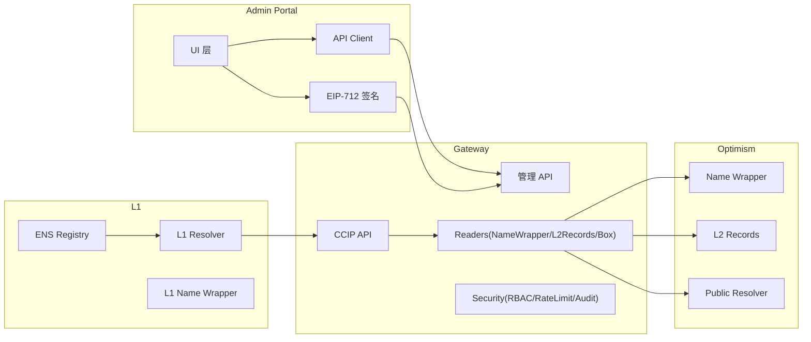
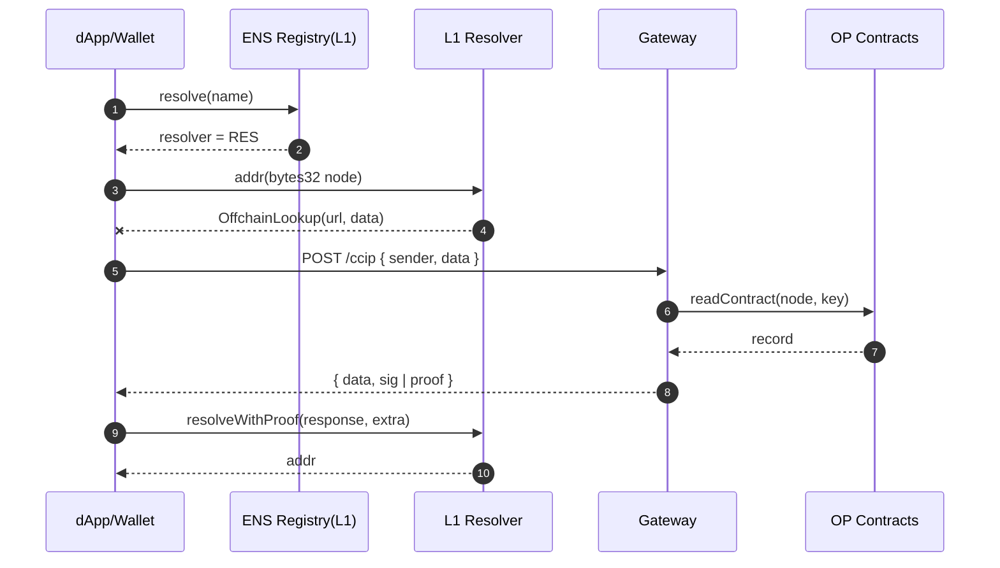
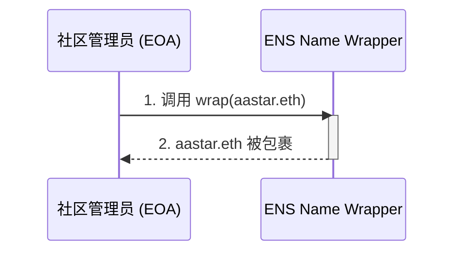
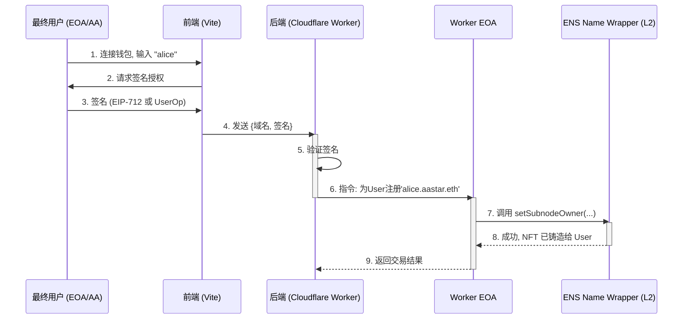
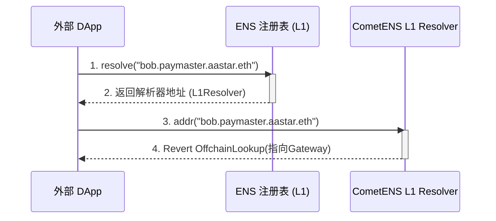
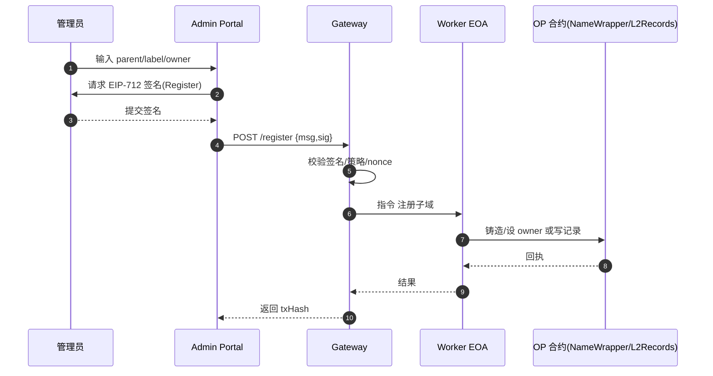
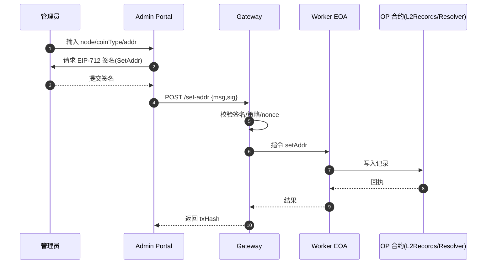

# CometENS 设计文档 (V3 - 最终版)

## 1. 产品设计

(与 V2 版本一致，核心是基于 ERC-1155 的子域名 NFT，提供 DID 和 DAPI 指向功能)

### 1.1. 核心愿景

CometENS 旨在成为一个开源、去中心化的 ENS 子域名分发和管理框架。它使任何拥有根域名（如 `aastar.eth`）的组织或个人，能够轻松地向其社区成员或用户分发二级或三级域名（如 `alice.aastar.eth`），并赋予这些子域名作为真正数字资产的应用价值。

### 1.2. 核心功能（支持Lyaer1,主要服务Layer2）

1.  **子域名即 NFT (ERC-1155)**
2.  **多链地址解析**
3.  **去中心化身份 (DID) 和社交图谱**
4.  **DAPI (去中心化服务) 指向**

### 1.3. 目标用户

1.  **Web3 项目方/社区**
2.  **DApp 开发者**
3.  **普通 Web3 用户**

---

## 2. 技术框架分析

### 2.1. 核心架构：Name Wrapper (L2) + CCIP-Read (L1)

最终架构融合了 Name Wrapper 和 CCIP-Read 两个核心方案，实现了“L2 管理所有权与记录，L1 安全低成本解析”的目标。

#### 总览与模块边界

用户/运营入口：
- Admin Portal（Vite 前端）：统一管理入口；.eth 可写；.box 只读+跳转/工单
- 钱包/应用：标准 ENS 解析（viem/ethers/钱包）

链上组件：
- 以太坊主网（L1）
  - ENS Registry（官方）
  - L1 Resolver（我们部署）
    - OffchainResolver：可信签名校验
    - OPResolver：存储证明校验
  - L1 Name Wrapper（可选）：包裹根域并烧断 CANNOT_SET_RESOLVER
- Optimism（L2）
  - 记录与所有权存储
    - 选型 A：L2Records 合约（MVP）
    - 选型 B：ENS Name Wrapper + Public Resolver（官方）
  - Worker EOA（网关控制），可扩展 Paymaster/AA

中台：
- CCIP‑Read Gateway（独立部署）
  - 解析 API：EIP‑3668 标准接口，返回签名或证明
  - 管理 API：注册子域、设置记录（Worker EOA 在 L2 写入）
  - Readers：NameWrapper/Records/box 适配
  - 安全与观测：EIP‑712、RBAC、限流、审计、日志

.box（OP）：
- my.box 合约状态只读展示；待官方开放写入能力后接入

```mermaid
graph TD
    subgraph "用户端"
        A[前端 (React + Vite)]
    end

    subgraph "链下服务 (Off-Chain)"
        B[后端 Gateway (TypeScript on Cloudflare Workers)]
        C[Worker EOA]
    end

    subgraph "Layer 1 (主网)"
        G[ENS 注册表]
        H(CometENS L1 Resolver) -- "CCIP-Read" --> B
    end

    subgraph "Layer 2 (Optimism)"
        D[ENS Name Wrapper]
        E[Public Resolver]
        F[ERC-4337 Paymaster]
    end

    U[用户 Wallet] <--> A
    A -- "1. 签名授权" --> B
    B -- "2. 验证, 查询L2, 构建Tx" --> C
    C -- "3. 调用L2合约 (Sponsored Tx)" --> D
    C -- "via" --> F
    D -- "设置所有者/记录" --> E
    G -- "解析 aastar.eth" --> H

    style D fill:#f9f,stroke:#333,stroke-width:2px
    style E fill:#f9f,stroke:#333,stroke-width:2px
```

### 2.2. 关键组件详解

1.  **L1 合约 (`CometENS_L1_Resolver`)**: 部署在以太坊主网，作为 `aastar.eth` 的解析器。它实现了 CCIP-Read 协议，收到解析请求后，会返回指向后端 Gateway 的 URL，并将从 Gateway 返回的带签名数据进行验证。

2.  **L2 合约 (官方)**: 我们将完全依赖部署在 Optimism 上的官方 `ENS Name Wrapper` 和 `Public Resolver` 合约来管理子域名 NFT 的所有权和记录。

3.  **后端 Gateway (Cloudflare Worker)**: 核心链下服务。负责响应来自 L1 解析器的 CCIP-Read 请求。它会查询 L2 上的 Name Wrapper 和 Public Resolver，获取真实数据，然后用 Worker EOA 签名并返回。

4.  **前端 (Vite App)**: 用户交互界面，负责连接钱包、引导签名、与后端通信。

5.  **Worker EOA**: 由后端服务控制的链上执行账户，负责支付 Gas 并将用户的意图（注册、设置记录）通过调用 L2 的 Name Wrapper 合约来执行。

### 2.x 组件内部结构图



### 2.x 数据流与字段关系



```
RegisterTypes:
  parent: string
  label: string
  owner: address
  nonce: uint256
  deadline: uint256

SetAddrTypes:
  node: bytes32
  coinType: uint256
  addr: bytes
  nonce: uint256
  deadline: uint256
```

### 2.3. 账户与交易模型

将分阶段实现：
*   **第一阶段**: 仅支持 EOA (MetaMask) 用户。用户通过 EIP-712 签名授权，由后端 Worker EOA 代理执行并支付 Gas。
*   **第二阶段**: 增加对 ERC-4337 账户的支持，通过 Paymaster 实现 AA 用户的 Gasless 体验。同时探索 EIP-7702 为 EOA 用户提供备选的 Gasless 方案。

---

## 3. 安全考量：信任根漏洞与缓解方案

### 3.1. 风险描述

本架构的“信任根”在于 L1 上的 `aastar.eth` 域名。其所有者有权在 L1 ENS 注册表中更改 `aastar.eth` 的解析器。如果所有者作恶，将解析器从我们的 `CometENS_L1_Resolver` 更换为恶意地址，整个子域名生态的 L1 解析路径将会中断，导致所有子域名资产价值受损。

### 3.2. 推荐解决方案：在 L1 烧断保险丝 (Fuse)

为了提供基于代码的、永久的信任承诺，建议 `aastar.eth` 的所有者执行以下一次性操作：

1.  在 **以太坊主网 (L1)** 上，将 `aastar.eth` 域名本身用 **L1 的 Name Wrapper** 包裹起来。
2.  调用 L1 Name Wrapper 的 `setFuses` 函数，永久性地烧断 (burn) `CANNOT_SET_RESOLVER` 这个保险丝。

此操作不可逆，将从技术上保证 `aastar.eth` 的 L1 解析器地址被永久锁定，任何人（包括所有者自己）都无法再更改，从而一劳永逸地解决了信任根风险。

---

## 4. 核心场景时序图

(与 V2 版本一致)

### 4.1 部署拓扑
- L1 Resolver：Ethereum Mainnet（主网）
- Gateway：Cloudflare Workers/Node（HTTPS、可水平扩展）
- L2 合约：Optimism Mainnet（MVP 可先 OP‑Sepolia）
- Admin Portal：静态托管（Cloudflare Pages/Vercel）
- 密钥：Worker EOA/网关签名人独立管理，环境隔离

#### 场景 1: 社区管理员初始化



#### 场景 2: 最终用户注册子域名



#### 场景 3: DApp 开发者使用子域名



### 2.x 路线对比与决策

- 自有 L2Records 全链路
  - 优点：实现快速、结构可控、交易成本更低；网关/前端迭代速度快，便于先跑通闭环
  - 局限：不自带 Name Wrapper 的 NFT 所有权/保险丝语义；少数直接读取 L2 官方 Resolver 的工具看不到自定义存储
  - 适用：MVP、快速验证与业务早期
- 官方 Name Wrapper + Public Resolver
  - 优点：语义完备（ERC‑1155、Fuses）、与 ENS 生态天然兼容；长期维护成本低
  - 局限：接入复杂度更高，流程更严格
  - 适用：稳定上线与长期运营
- 决策：MVP 先使用 L2Records 打通“L2 存储—Gateway 读取—L1 解析”，验证产品闭环；稳定后提供同步迁移至官方 Resolver/Name Wrapper 的工具与灰度切换

---

### 4.2 管理流程：注册子域名



### 4.3 管理流程：设置地址记录



## 5. 里程碑与任务进度

里程碑 A：可信签名版解析 MVP（进行中）
- A1 网关跑通 CCIP‑Read（解析 API、addr/text/contenthash、签名返回）【计划】
- A2 部署 L2Records 合约或接 Name Wrapper（只读）【进行中】
- A3 部署 L1 OffchainResolver 并绑定测试根域【计划】
- A4 Admin Portal 最小闭环（注册/设置/查询）【计划】
- A5 .box 仪表盘（只读 + 跳转/工单模板）【计划】
- A6 安全与运维基础（EIP‑712、nonce/过期、限流、日志）【计划】

里程碑 B：Name Wrapper + NFT 子域（计划）
- B1 集成官方 Name Wrapper：铸造/转移子域 NFT
- B2 Portal 批量发放/记录设置、冲突检测与命名规则
- B3 审计日志与监控看板

里程碑 C：存储证明与信任最小化（计划）
- C1 证明生成：接入 Bedrock 状态根与证明
- C2 部署 OPResolver，启用 resolveWithProof
- C3 切换与回退策略

里程碑 D：生产强化与治理（计划）
- D1 L1 包裹根域并烧断 CANNOT_SET_RESOLVER（谨慎执行）
- D2 密钥轮换、RBAC、报警与应急预案
- D3 运维流程与灾备演练

里程碑 E：.box 写路径（依赖官方，待定）
- E1 接入 my.box 授权/角色/接口
- E2 与 .eth 管理闭环对齐
