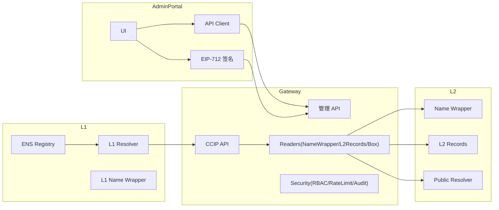
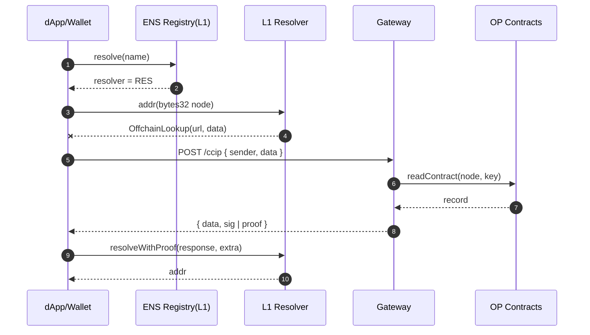

# CometENS 设计文档（ens-tool 版）

## 核心决策
- MVP 路线：自有 L2Records → Gateway(viem) → L1 OffchainResolver（可信签名），尽快打通闭环
- 稳定后迁移：提供迁移脚本同步到官方 Name Wrapper/Public Resolver，灰度切换 Reader

## 组件结构


## 数据流与字段关系


EIP‑712（管理 API 草案）：
```
RegisterTypes:
  parent: string
  label: string
  owner: address
  nonce: uint256
  deadline: uint256

SetAddrTypes:
  node: bytes32
  coinType: uint256
  addr: bytes
  nonce: uint256
  deadline: uint256
```

## 路线对比与决策
- L2Records：实现快，结构可控，交易便宜；不自带 Name Wrapper 的 NFT/权限语义；少数直接读 L2 官方 Resolver 的工具看不到自定义存储。适合 MVP。
- 官方 Name Wrapper + Public Resolver：语义完备、生态兼容；接入复杂度更高。适合长期。
- 决策：先 L2Records，后迁移官方。

## 里程碑 A（最新标记）

- A1 网关跑通 CCIP‑Read（viem 版解析 API、addr/text/contenthash、签名返回）【计划】
- A2 部署 L2Records 或接 Name Wrapper（只读）【进行中】
- A3 部署 L1 OffchainResolver 并绑定测试根域【计划】
- A4 Admin Portal 最小闭环（注册/设置/查询）【计划】
- A5 .box 仪表盘（只读 + 跳转/工单模板）【计划】
- A6 安全与运维基础（EIP‑712、nonce/过期、限流、日志）【计划】

开发计划与任务拆解见：[development_plan_zh.md](file:///Users/jason/Dev/aastar/ens-tool/docs/development_plan_zh.md)
